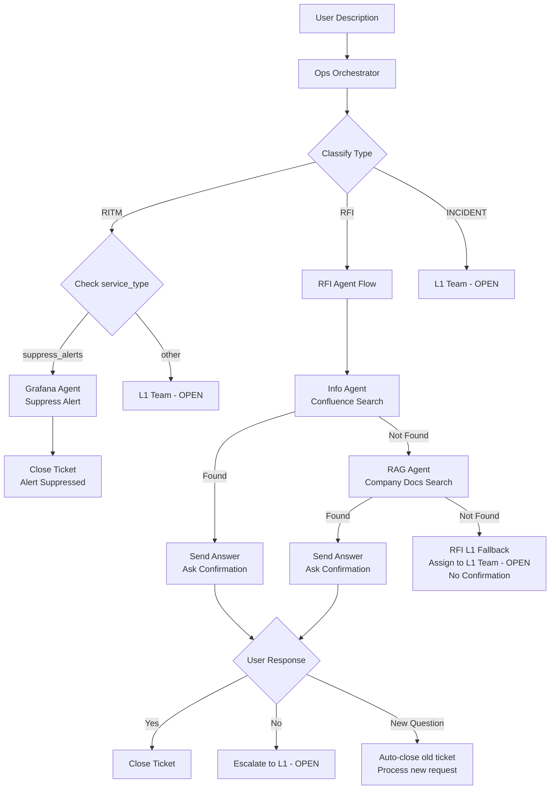

# Chatbot Workflow Journey Chart

## Overview

The ServiceNow Operations Agent (Ops Agent) provides an intelligent chatbot interface that classifies user requests into three ticket types: **RFI (Request for Information)**, **RITM (Requested Item)**, and **INCIDENT**. The workflow orchestrates automated information retrieval with intelligent fallback to L1 Team when needed.

## Workflow Steps

### 1. Greeting & Service Presentation

**Ops Agent** greets the user with available services:

```
👋 Hello! I'm your ServiceNow Operations Agent. How can I help you today?

I can assist with:
• 📚 RFI (Request for Information) – Search for information, ask 'how to' questions, or research topics
• 🎫 RITM (Requested Item) – Request access, software, hardware, or services
• 🚨 INCIDENT – Report system issues, errors, or service disruptions

Please describe what you need help with.
```

### 2. User Input

User enters ticket description in natural language:

- "How to onboard a new employee?"
- "Need access to Jira"
- "My laptop is not working"

### 3. Ops Orchestrator Classification

**Ops Orchestrator** (LLM-powered classifier) analyzes the description and identifies ticket type:

#### Classification Rules:

**RFI** - User is searching for information, asking 'how to' questions, or researching topics:

- Keywords: "what is", "how to", "explain", "tell me about", "where can I find"
- Examples:
  - "What is the password policy?"
  - "How to onboard new employee?"
  - "Tell me about the leave policy"

**RITM** - User is requesting access, software, hardware, or services:

- Keywords: "need access", "request", "install", "create account"
- Examples:
  - "Need access to Jira"
  - "Request laptop"
  - "Install Slack on my machine"

**INCIDENT** - User reports technical issues, errors, or service disruptions:

- Keywords: "not working", "error", "broken", "can't access", "locked"
- Examples:
  - "My account is locked"
  - "Email not working"
  - "Can't login to system"

### 4. Ticket Type Routing



### 5. RFI Agent Workflow (Information Retrieval)

The RFI Agent follows a 3-tier information retrieval system:

#### Tier 1: Info Agent (Confluence MCP Server)

- Searches Confluence documentation via MCP server
- Retrieves company wikis, policies, procedures
- **If found**:
  - LLM validates information relevance
  - Shows answer with Confluence sources
  - **Asks user confirmation:** "Did this answer your question?"
  - User says "yes" → Status: **CLOSED**
  - User says "no" → Escalates to **L1 Team**, Status: **OPEN**
  - User asks new question → Auto-closes old ticket, processes new request

#### Tier 2: RAG Agent (Company Knowledge Base)

- Searches vector database of company documents
- Uses semantic search with embeddings
- **If found**:
  - LLM validates information completeness
  - Shows answer with document sources
  - **Asks user confirmation:** "Did this answer your question?"
  - User says "yes" → Status: **CLOSED**
  - User says "no" → Escalates to **L1 Team**, Status: **OPEN**
  - User asks new question → Auto-closes old ticket, processes new request

#### Tier 3: RFI L1 Fallback (Manual Research)

- **If no information found** in Confluence or RAG:
  - Assigns ticket to **L1 Team** for manual research
  - Status: **OPEN** (awaiting L1 Team research)
  - **No confirmation prompt** (since no answer was provided)
  - User can immediately ask new questions
  - Ticket includes:
    - Sources already checked (Confluence + RAG)
    - Explanation that automated search was insufficient
    - Next steps: L1 Team will research and respond

### 6. RITM Workflow

#### RITM with `service_type=suppress_alerts` (Alert Suppression)

**Special automated flow for Grafana alert suppression:**

1. **Chatbot collects required fields:**
   - Alert ID (1-4)
   - Application (website1/website2)
   - Start time
   - End time

2. **Routing:**
   - Ticket routed directly to **Grafana Agent** (bypasses Info/RAG agents)
   - service_type: `suppress_alerts`
   - application: stored in ticket

3. **Grafana Agent actions:**
   - Calls Grafana API to suppress alert
   - Assigns to: **Ops Agent**
   - Status: **CLOSED**
   - No user confirmation needed

4. **Source tracking:**
   - Chatbot: `source="chatbot"` (💬 Chatbot)
   - Form: `source="form"` (📝 Form)

#### Other RITM (Access Requests, Provisioning)

**Standard RITM tickets** (not suppress alerts):

- Assigned to: **L1 Team**
- Status: **OPEN** (awaiting manual processing)
- L1 Team handles: access requests, hardware/software provisioning

### 7. INCIDENT Workflow

**INCIDENT** tickets are immediately assigned to L1 Team:

- Assigned to: **L1 Team**
- Status: **OPEN** (awaiting manual processing)
- L1 Team handles: technical troubleshooting, system issues

## Key Features

### ✅ Intelligent Classification

- LLM-powered intent detection
- Context-aware categorization
- Automatic ticket type assignment

### ✅ Multi-Tier Information Retrieval (RFI Only)

1. **Confluence MCP Server** - Live documentation
2. **RAG Vector Database** - Company knowledge base
3. **L1 Team Fallback** - Human research when needed

### ✅ No Web Search

- Web search (RFI Agent) **removed** from workflow
- Only trusted internal sources: Confluence + RAG
- External searches handled manually by L1 Team

### ✅ Smart Ticket Management

- RFI: Auto-close when answer found, assign to L1 if not
- RITM: Always assign to L1 Team (OPEN status)
- INCIDENT: Always assign to L1 Team (OPEN status)

## Workflow Decision Logic

### Info Agent Decision (Confluence Search)

```python
if info_found and llm_validates_answer:
    close_ticket_with_answer()
    return END
else:
    continue_to_rag_agent()
```

### RAG Agent Decision (Vector DB Search)

```python
if rag_found and llm_validates_completeness:
    close_ticket_with_answer()
    return END
else:
    assign_to_l1_team_for_research()
```

### RFI L1 Fallback (No Info Found)

```python
def rfi_l1_fallback(ticket):
    ticket.assigned_to = "L1 Team"
    ticket.status = "OPEN"
    ticket.work_comments = """
        Automated system searched:
        - Confluence documentation
        - Company knowledge base (RAG)

        No sufficient information found.
        L1 Team will research and respond.
    """
    return ticket
```

## Example Scenarios

### Scenario 1: RFI - Info Found in Confluence

**User**: "What is the password policy?"

1. Classified as: **RFI**
2. Info Agent searches Confluence
3. Found: "Password Requirements" page
4. LLM validates: Answer is complete
5. **Ticket closed** with password policy details + Confluence link

### Scenario 2: RFI - Info Found in RAG

**User**: "How to setup VPN?"

1. Classified as: **RFI**
2. Info Agent searches Confluence → Not found
3. RAG Agent searches company docs → Found VPN setup guide
4. LLM validates: Instructions are complete
5. **Ticket closed** with VPN setup steps + document source

### Scenario 3: RFI - Assign to L1 (No Info)

**User**: "What is the process for onboarding contractors in UK office?"

1. Classified as: **RFI**
2. Info Agent searches Confluence → Not found
3. RAG Agent searches company docs → Not found
4. RFI L1 Fallback triggered
5. **Assigned to L1 Team** (OPEN) for manual research

### Scenario 4: RITM - Direct to L1

**User**: "Need access to Salesforce"

1. Classified as: **RITM**
2. **Immediately assigned to L1 Team** (OPEN)
3. L1 Team handles access provisioning

### Scenario 5: INCIDENT - Direct to L1

**User**: "My email is not working"

1. Classified as: **INCIDENT**
2. **Immediately assigned to L1 Team** (OPEN)
3. L1 Team troubleshoots technical issue

## Technical Implementation

### Files Modified

1. `backend/graph/chatbot_nodes.py` - Greeting + Classification
2. `backend/graph/workflow.py` - Workflow routing (RFI → Info → RAG → L1)
3. `backend/graph/nodes.py` - Intent classification logic
4. `backend/graph/rfi_l1_fallback.py` - NEW - L1 fallback node

### Workflow Graph

```python
graph.add_conditional_edges(
    "classify",
    lambda s: s.intent,
    {
        "rfi": "info",           # RFI → Info Agent
        "ritm": "assign_l1",     # RITM → L1 Team
        "incident": "assign_l1"  # INCIDENT → L1 Team
    }
)

# Info Agent → RAG or END
graph.add_conditional_edges(
    "info",
    lambda s: "end" if s.info_found else "rag"
)

# RAG Agent → L1 Fallback or END
graph.add_conditional_edges(
    "rag",
    lambda s: "end" if s.rag_found else "rfi_l1_fallback"
)
```

## Benefits

✅ **Automated Information Retrieval** - 2-tier search before human escalation
✅ **Reduced L1 Workload** - Common questions answered automatically  
✅ **Faster Response Times** - Instant answers from Confluence/RAG
✅ **Quality Control** - LLM validates answer relevance before closing
✅ **Clear Escalation Path** - Unresolved RFI tickets assigned to L1 with context
✅ **Trusted Sources Only** - No external web searches, only internal docs
✅ **Smart Routing** - RITM/INCIDENT go directly to L1 (no unnecessary automation)

## Status Indicators

| Ticket Type            | Auto-Resolution | Status if Resolved | Status if Unresolved | Confirmation Prompt   |
| ---------------------- | --------------- | ------------------ | -------------------- | --------------------- |
| RFI                    | Yes (Info/RAG)  | CLOSED             | OPEN (L1 Team)       | Yes (if answer found) |
| RITM (suppress_alerts) | Yes (Grafana)   | CLOSED             | N/A                  | No                    |
| RITM (other)           | No              | N/A                | OPEN (L1 Team)       | No                    |
| INCIDENT               | No              | N/A                | OPEN (L1 Team)       | No                    |

## Notes

- **RITM suppress alerts automation**: RITM tickets with suppress_alerts service_type route directly to Grafana Agent
- **Source tracking**: All tickets tagged with creation method - chatbot (💬) or form (📝)
- **Smart confirmation flow**: Users can ask new questions during confirmation, system auto-closes old ticket
- **L1 fallback behavior**: When no answer found, assigns to L1 without confirmation prompt
- **Web search removed**: RFI Agent no longer performs external Tavily searches
- **Confluence first**: RFI always checks Confluence before RAG
- **LLM validation**: Answers are validated by LLM before showing to user
- **Source attribution**: All answers include Confluence URLs or document sources
