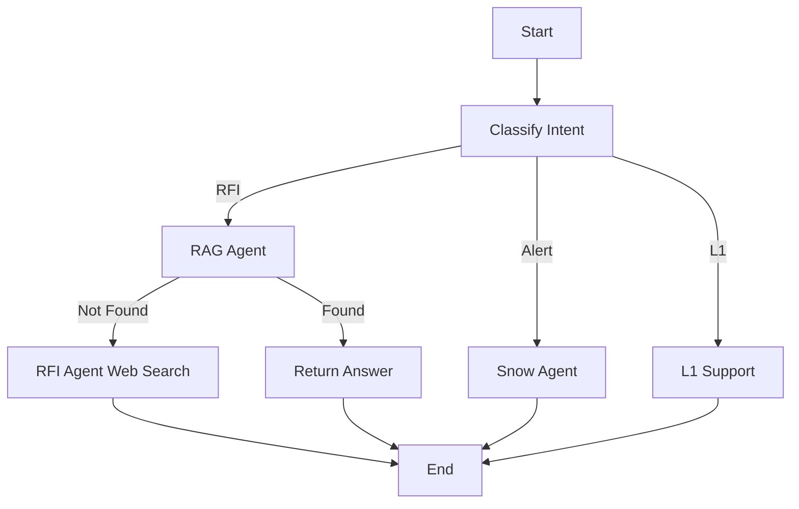

# RAG Agent Documentation

## Overview

The RAG (Retrieval-Augmented Generation) Agent provides intelligent document-based question answering using company documents. It searches through trained company documents first before falling back to web search, ensuring accurate and policy-compliant responses.

## Architecture

```
User Question (RFI)
        ↓
  Intent Classifier
        ↓
    RAG Agent ← searches → Vector Database
        ↓                      ↑
   Found answer?              |
        ↓                      |
    YES → Return answer   Documents trained here
        ↓                      ↑
    NO → RFI Agent (web search)
```

## Features

### 1. Document Management

- **Upload**: Support for PDF, MD, TXT, DOC, DOCX files
- **Training**: Automatic chunking, embedding, and vectorization
- **Organization**: Track status, size, chunks, and metadata
- **Search**: Test vector search with similarity scores

### 2. Intelligent Routing

- **Primary**: RAG Agent checks company docs first
- **Fallback**: RFI Agent searches web if no relevant docs found
- **Confidence**: Only answers if document relevance meets threshold

### 3. Vector Database

- **Engine**: FAISS (Facebook AI Similarity Search)
- **Embeddings**: sentence-transformers/all-MiniLM-L6-v2
- **Chunking**: 1000 characters with 200 overlap
- **Storage**: Persistent on disk

## Usage

### Admin: Upload & Train Documents

1. Navigate to **Admin: RAG Docs** page
2. Select a document file
3. Click "Upload"
4. Once uploaded, click "Train" to process the document
5. Training creates text chunks and stores embeddings

### User: Ask Questions

1. Go to **Chat with AI** or **Create Ticket**
2. Ask a question about company policies or procedures
3. System automatically:
   - Classifies as RFI request
   - Searches RAG database first
   - Returns answer from company docs if found
   - Falls back to web search if not found

## Technical Details

### Document Processing Pipeline

```python
1. Upload Document
   └─> Save to /data/uploads/

2. Train Document
   ├─> Load document (PDF/MD/TXT/DOC)
   ├─> Split into chunks (1000 chars, 200 overlap)
   ├─> Generate embeddings (sentence-transformers)
   ├─> Store in FAISS vector database
   └─> Save metadata (chunks, status, etc.)

3. Query Processing
   ├─> Convert query to embedding
   ├─> Search FAISS (cosine similarity)
   ├─> Retrieve top K results (default: 3)
   ├─> Filter by relevance threshold (score < 1.5)
   └─> Generate answer with LLM
```

### Vector Search

- **Algorithm**: L2 (Euclidean) distance
- **Threshold**: 1.5 (lower = more similar)
- **Top K**: 3 most relevant chunks
- **Metadata**: Includes filename, doc_id, source

### LLM Integration

- **Model**: llama-3.3-70b-versatile (Groq)
- **Temperature**: 0.3 (more focused)
- **Context**: Includes retrieved document chunks
- **Fallback**: If insufficient info, triggers RFI Agent

## API Endpoints

### Document Management

```bash
# Upload document
POST /documents/upload
Content-Type: multipart/form-data
Body: file=<file>, uploaded_by=<user>

# List all documents
GET /documents

# Get document metadata
GET /documents/{doc_id}

# Train document
POST /documents/{doc_id}/train

# Delete document
DELETE /documents/{doc_id}

# Search documents
POST /documents/search
Body: query=<string>, k=<int>
```

## Dependencies

```
langchain              # Document processing framework
langchain-community    # Loaders and vector stores
sentence-transformers  # Embedding model
faiss-cpu             # Vector database
pypdf                 # PDF processing
python-docx           # Word document processing
unstructured          # Universal document loader
markdown              # Markdown processing
```

## Configuration

### Storage Paths

- **Uploads**: `./data/uploads/` - Original document files
- **Vector DB**: `./data/vectordb/` - FAISS index and embeddings
- **Metadata**: In-memory (documents_store dict)

### Embedding Model

```python
model_name = "sentence-transformers/all-MiniLM-L6-v2"
# Properties:
# - Dimension: 384
# - Speed: Fast
# - Quality: Good for general text
# - Size: ~80MB
```

### Text Splitter

```python
chunk_size = 1000      # Characters per chunk
chunk_overlap = 200    # Overlap between chunks
length_function = len  # Character counting
```

## Workflow Integration

### Modified LangGraph Flow



## Example Usage

### Example 1: Company Policy Question

**User**: "What are the password requirements?"

**RAG Agent**:

1. Searches vector DB for "password requirements"
2. Finds relevant chunk from IT Security Policy
3. Generates answer using LLM + context
4. Returns: "All employees must follow these password requirements: Minimum 12 characters..."

**Sources**: Company IT Security Policy

### Example 2: External Tech Question

**User**: "How does Kubernetes work?"

**RAG Agent**:

1. Searches vector DB for "kubernetes"
2. No relevant company documents found
3. Returns rag_found=False

**RFI Agent**:

1. Searches web using Tavily
2. Returns answer from external sources

## Performance Considerations

### Embedding Generation

- **First time**: Downloads model (~80MB)
- **Subsequent**: Cached locally
- **Speed**: ~100 documents/sec

### Search Performance

- **Query time**: < 100ms for 1000s of documents
- **Memory**: ~1MB per 1000 document chunks
- **Scaling**: Horizontal with multiple FAISS indices

### Training Time

- **PDF (10 pages)**: ~5-10 seconds
- **Markdown**: ~2-5 seconds
- **Large docs (100+ pages)**: ~30-60 seconds

## Limitations

1. **Deletion**: FAISS doesn't support efficient deletion. Documents are removed from metadata but chunks remain in vector DB until rebuild.

2. **Memory**: All document metadata stored in-memory. For production, use database.

3. **Concurrent training**: No queue system. Training one document at a time.

4. **File size**: No explicit limit, but large files may timeout.

## Best Practices

### Document Preparation

1. **Clean formatting**: Remove headers/footers
2. **Clear structure**: Use headings and sections
3. **Concise content**: Avoid redundancy
4. **Relevant info**: Only upload policy-relevant documents

### Training Strategy

1. **Start small**: Upload 5-10 key documents first
2. **Test search**: Use search feature to verify retrieval
3. **Iterate**: Add more documents based on common questions
4. **Update regularly**: Retrain when policies change

### Query Optimization

1. **Specific questions**: "What is the VPN process?" vs "Tell me about IT"
2. **Use keywords**: Include terms from documents
3. **Natural language**: System handles conversational queries

## Troubleshooting

### "Embeddings not initialized"

**Cause**: sentence-transformers not installed
**Fix**: Install dependencies: `pip install sentence-transformers`

### "No relevant documents found"

**Cause**: Either no documents trained or query doesn't match
**Fix**:

1. Check documents are trained (status = "trained")
2. Try different query phrasing
3. Lower relevance threshold in code

### Training fails with error

**Cause**: Unsupported file format or corrupted file
**Fix**:

1. Verify file extension matches content
2. Try re-uploading
3. Check backend logs for specific error

### Search returns irrelevant results

**Cause**: Threshold too high or poor document quality
**Fix**:

1. Adjust threshold in rag_node.py
2. Improve document content quality
3. Add more relevant documents

## Future Enhancements

1. **Metadata filtering**: Filter by document type, date, author
2. **Persistent storage**: PostgreSQL for metadata
3. **Batch training**: Queue system for multiple documents
4. **Incremental updates**: Update specific documents without retraining all
5. **Multi-language**: Support non-English documents
6. **Advanced chunking**: Semantic chunking vs fixed-size
7. **Hybrid search**: Combine vector + keyword search
8. **Analytics**: Track most-searched queries, document usage

## Security Considerations

1. **Access control**: Add authentication to admin endpoints
2. **Document validation**: Scan uploads for malware
3. **Data privacy**: Ensure sensitive docs are properly classified
4. **Audit logging**: Track who uploads/trains/deletes documents

## Monitoring

### Key Metrics

- **Documents**: Total uploaded, trained, pending
- **Search latency**: Average query time
- **Hit rate**: RAG found vs RFI fallback ratio
- **Accuracy**: User feedback on answers

### Health Checks

```bash
# Check if vector DB loaded
GET /health
# Look for: vector_store_loaded: true

# Test search
POST /documents/search
Body: query="test", k=1
# Should return results if documents trained
```

## Support

For issues or questions:

- Check logs: `docker-compose logs backend`
- Review uploaded documents: Admin RAG page
- Test search: Use search feature on admin page
- Contact: IT Support team
