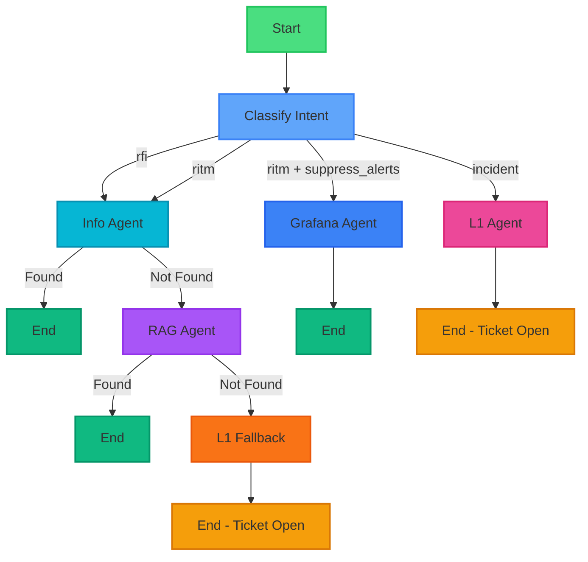
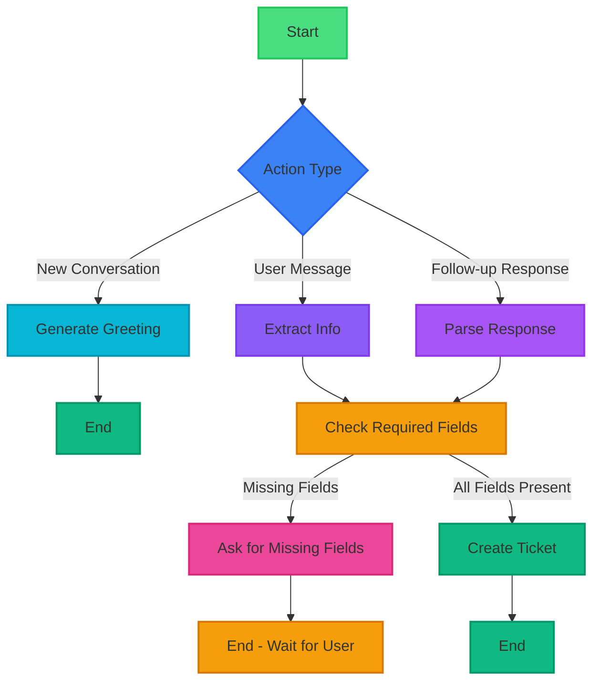

# LangGraph Workflow Diagrams - Ops AI Agent

## 1. Main Ticket Processing Workflow



### Node Descriptions

| Node                | Function             | Purpose                                                 | Output                                          |
| ------------------- | -------------------- | ------------------------------------------------------- | ----------------------------------------------- |
| **classify_intent** | LLM Classification   | Analyzes ticket_type or description to determine intent | Sets `intent` field (rfi/ritm/incident)         |
| **grafana_agent**   | Alert Suppression    | Silences Grafana alert for RITM suppress_alerts service | Sets `closed=True`, `assigned_to="Ops Agent"`   |
| **info_agent**      | Confluence Search    | Searches Confluence via MCP server                      | Sets `info_found`, `work_comments` if found     |
| **rag_agent**       | Internal Docs Search | Searches vector DB for company documentation            | Sets `rag_found`, `work_comments` if found      |
| **rfi_l1_fallback** | L1 Escalation        | Escalates RFI/RITM when no info found                   | Sets `assigned_to="L1 Team"`, ticket stays OPEN |
| **l1_agent**        | Direct L1 Assignment | Routes INCIDENT tickets to L1 team                      | Sets `assigned_to="L1 Team"`                    |

### Intent Classification Logic

**Prompt to LLM:**

> Output 'rfi' if user is asking for information, research, documentation, explanation, how-to
> Output 'ritm' if user is requesting access, software, hardware, or services
> Output 'incident' for all other requests (technical issues, errors, system problems)

**Heuristic Fallback Keywords:**

- **rfi**: know more, how to, what is, explain, search, find, information, tell me about
- **ritm**: need access, request, install, create account, provision, setup
- **incident**: error, not working, broken, down, issue, problem

---

## 2. Chatbot Conversation Workflow



### Chatbot Nodes

| Node                        | Function            | Purpose                                                  | Output                                  |
| --------------------------- | ------------------- | -------------------------------------------------------- | --------------------------------------- |
| **generate_greeting**       | Welcome Message     | Sends initial greeting to user                           | Sets `messages` with greeting           |
| **extract_info**            | LLM Extraction      | Extracts intent, alert_id, description from user message | Populates state fields                  |
| **parse_user_response**     | Response Parser     | Parses follow-up answers to fill missing fields          | Updates state with new info             |
| **check_required_fields**   | Validation          | Checks if all required fields are present                | Sets `missing_fields` list              |
| **ask_for_missing_fields**  | Follow-up Generator | Generates contextual question for missing info           | Adds assistant message                  |
| **create_ticket_from_chat** | Ticket Creation     | Creates ticket and processes via main workflow           | Sets `ticket_created=True`, `ticket_id` |

### Conversation Flow Example

```
1. User: "start"
   → greeting (action=start) → generate_greeting → END

2. User: "suppress alert A-1"
   → extract_info → check_required_fields
   → [alert_id=A-1, description="suppress alert A-1"]
   → create_ticket → END

3. User: "block ip address"
   → extract_info → check_required_fields
   → [description="block ip address", missing: which IP?]
   → ask_for_missing_fields → END

4. User: "192.168.1.100"
   → parse_user_response → check_required_fields
   → [description="block ip address 192.168.1.100"]
   → create_ticket → END
```

---- Next.js"]
UI["User Interface
Chat / Forms"]
API_CLIENT["API Client
api.ts"]
end

    subgraph Backend["Backend - FastAPI"]
        CHAT["/chat Endpoint
        main.py"]
        PROCESS["/process_ticket Endpoint
        main.py"]

        subgraph ChatbotFlow["Chatbot Workflow"]
            CB_GREETING[greeting]
            CB_EXTRACT[extract]
            CB_CHECK[check_fields]
            CB_ASK[ask_missing]
            CB_CREATE[create_ticket]
        end

        subgraph MainFlow["Main Ticket Workflow"]
            M_CLASSIFY[classify_intent]
            M_GRAFANA[handle_grafana]
            M_RFI[rfi_agent]
            M_L1[assign_l1]
        end
    end

    subgraph External["External Services"]
        GROQ["Groq LLM
        llama-3.1-8b"]
        TAVILY["Tavily Search
        Web Research"]
        GRAFANA_API["Grafana API
        Alert Suppression"]
        SNOW_API["ServiceNow API
        Ticket Management"

    subgraph External["External Services"]
        GROQ[Groq LLM<br/>llama-3.1-8b]
        TAVILY[Tavily Search<br/>Web Research]
        GRAFANA_API[Grafana API<br/>Alert Suppression]
        SNOW_API[ServiceNow API<br/>Ticket Management]
    end

    UI -->|HTTP POST| API_CLIENT
    API_CLIENT -->|/chat| CHAT
    API_CLIENT -->|/process_ticket| PROCESS

    CHAT --> ChatbotFlow
    CB_CREATE --> MainFlow
    PROCESS --> MainFlow

    M_CLASSIFY -.->|LLM Classification| GROQ
    M_GRAFANA -.->|Silence Alert| GRAFANA_API
    M_RFI -.->|Web Search| TAVILY
    M_RFI -.->|Summarization| GROQ
    MainFlow -.->|Store Tickets| SNOW_API

    style Frontend fill:#1e293b,stroke:#334155,stroke-width:2px,color:#fff
    style Backend fill:#0f172a,stroke:#1e293b,stroke-width:2px,color:#fff
    style External fill:#581c87,stroke:#6b21a8,stroke-width:2px,color:#fff
    style ChatbotFlow fill:#164e63,stroke:#155e75,stroke-width:2px,color:#fff
    style MainFlow fill:#7c2d12,stroke:#9a3412,stroke-width:2px,color:#fff

````

---

## 4. State Models

### OpsState (Main Workflow)

```python
class OpsState(BaseModel):
    ticket_id: Optional[str] = None           # TKT-1, TKT-2, etc.
    description: Optional[str] = None         # User's description
    intent: Optional[str] = None              # rfi | ritm | incident
    alert_id: Optional[str] = None            # Grafana alert ID (1, 2, 3, 4)
    ticket_type: Optional[str] = None         # Explicit type override
    assigned_to: Optional[str] = None         # "Ops Agent" | "L1 Team" | "RAG Agent"
    closed: Optional[bool] = None             # Ticket closure status
    start_time: Optional[datetime] = None     # Suppression start time
    end_time: Optional[datetime] = None       # Suppression end time
    result: Optional[str] = None              # Result message
    work_comments: Optional[str] = None       # Research results or notes
    service_type: Optional[str] = None        # For RITM tickets (suppress_alerts, etc.)
    application: Optional[str] = None         # For suppress_alerts service
    rag_found: Optional[bool] = None          # Whether RAG found results
    rag_results: Optional[Any] = None         # RAG search results
    info_found: Optional[bool] = None         # Whether Info Agent found results
    info_results: Optional[Any] = None        # Info Agent search results
````

### ChatbotState (Conversation Workflow)

```python
class ChatbotState(BaseModel):
    session_id: str                           # Unique session identifier
    messages: List[Dict] = []                 # Conversation history
    intent: Optional[str] = None              # Detected intent (rfi/ritm/incident)
    description: Optional[str] = None         # Extracted description
    alert_id: Optional[str] = None            # Extracted alert ID
    missing_fields: List[str] = []            # Fields that need user input
    ticket_created: bool = False              # Whether ticket was created
    ticket_id: Optional[str] = None           # Created ticket ID
    details_requested: bool = False           # Prevent infinite loops
    awaiting_confirmation: bool = False       # Waiting for user to confirm RFI/RITM answer
```

---

## 5. Workflow Decision Points

### Main Workflow: classify_intent

```
INPUT: state.description, state.ticket_type

DECISION LOGIC:
1. Check explicit state.ticket_type (from form submission)
   - If "rfi" → intent = "rfi"
   - If "ritm" → intent = "ritm"
   - If "incident" → intent = "incident"

2. Use LLM classification (from chatbot)
   - Send description to Groq LLM
   - Parse response for intent

3. Fallback to heuristics
   - Check for keywords:
     * "how to", "what is", "explain" → "rfi"
     * "need access", "request", "install" → "ritm"
     * Default → "incident"

OUTPUT: state.intent = "rfi" | "ritm" | "incident"

ROUTING LOGIC:
- If intent == "ritm" AND service_type == "suppress_alerts" → grafana_agent
- If intent == "ritm" OR intent == "rfi" → info_agent
- If intent == "incident" → l1_agent
```

### Chatbot Workflow: check_required_fields

```
INPUT: state.description, state.intent, state.alert_id

DECISION LOGIC:
1. If intent == "silence_alert":
   - Required: alert_id
   - Optional: start_time, end_time

2. If description is vague (< 10 chars or generic):
   - Add to missing_fields: "description_details"

3. Check details_requested flag:
   - If True and still missing → skip asking (avoid loops)
   - If False → allow asking once

OUTPUT:
- state.missing_fields = [] → route to "complete"
- state.missing_fields = [...] → route to "has_missing"
```

---

## 6. Error Handling & Edge Cases

### Main Workflow

| Scenario              | Handling                                        |
| --------------------- | ----------------------------------------------- |
| LLM API Failure       | Fall back to heuristic keyword matching         |
| Tavily Search Failure | Return formatted error message in work_comments |
| Grafana API Failure   | Log error, set result message                   |
| Vague Description     | Route to L1 for manual handling                 |

### Chatbot Workflow

| Scenario                   | Handling                                          |
| -------------------------- | ------------------------------------------------- |
| Infinite Loop Prevention   | `details_requested` flag prevents repeated asking |
| Session Not Found          | Create new session with greeting                  |
| User Provides Partial Info | Parse response, update state, re-check fields     |
| User Changes Topic         | Extract new intent, create new ticket             |

---

## 7. Workflow Execution Examples

### Example 1: Alert Suppression

```
User: "suppress alert A-1 for 1 hour"

Main Workflow:
START → classify_intent
  ├─ LLM detects: "silence_alert"
  ├─ state.intent = "silence_alert"
  ├─ state.alert_id = "A-1"
  └─ state.description = "suppress alert A-1 for 1 hour"
→ handle_grafana
  ├─ Call silence_alert("A-1", start=now, end=now+1h)
  ├─ state.assigned_to = "Snow Agent"
  ├─ state.closed = True
  └─ state.result = "Alert A-1 suppressed..."
→ END

Result: Ticket TKT-1, Status: CLOSED, Assigned: Snow Agent
```

### Example 2: Information Request

```
User: "what is kubernetes?"

Main Workflow:
START → classify_intent
  ├─ LLM detects: "rfi"
  ├─ state.intent = "rfi"
  └─ state.description = "what is kubernetes?"
→ rfi_agent
  ├─ TavilyClient.search("what is kubernetes?")
  ├─ Collect top 3 results
  ├─ LLM summarize with sources
  ├─ state.work_comments = "Kubernetes is..."
  ├─ state.assigned_to = "RFI Agent"
  └─ state.closed = True
→ END

Result: Ticket TKT-2, Status: CLOSED, Work Comments: Research findings
```

### Example 3: Chatbot with Follow-up

```
User: "start"
Chatbot → greeting → END
Bot: "👋 Hello! I'm the Snow AI Assistant..."

User: "block ip address"
Chatbot → extract_info
  ├─ state.intent = "general"
  ├─ state.description = "block ip address"
  └─ state.missing_fields = []
→ check_required_fields
  ├─ Description too vague
  ├─ state.missing_fields = ["description_details"]
  └─ state.details_requested = True
→ ask_for_missing_fields → END
Bot: "Which IP address would you like to block?"

User: "192.168.1.100"
Chatbot → parse_user_response
  ├─ Append "192.168.1.100" to description
  └─ state.description = "block ip address 192.168.1.100"
→ check_required_fields
  ├─ state.missing_fields = []
  └─ route: "complete"
→ create_ticket_from_chat
  ├─ Call main workflow with state
  ├─ state.ticket_created = True
  └─ state.ticket_id = "TKT-3"
→ END
Bot: "✅ Ticket TKT-3 has been created..."

Result: Ticket TKT-3, Type: general, Assigned: L1 Team
```

---

## 8. Performance Characteristics

| Metric                  | Value         | Notes                                        |
| ----------------------- | ------------- | -------------------------------------------- |
| **Average Latency**     |               |                                              |
| - Alert Suppression     | 500-1000ms    | Grafana API call + LLM classification        |
| - RFI Agent             | 2-5s          | Web search (1-3s) + LLM summarization (1-2s) |
| - L1 Assignment         | 200-500ms     | LLM classification only                      |
| **Concurrent Sessions** | Unlimited     | Stateless execution per request              |
| **LLM Tokens**          |               |                                              |
| - Classification        | ~150 tokens   | System prompt + user message                 |
| - RFI Summary           | ~800 tokens   | Context + summary generation                 |
| **Web Search**          | Max 3 results | Tavily API limit for cost optimization       |

---

## Documentation

For detailed implementation documentation:

- [Backend Documentation](BACKEND_DOCUMENTATION.md)
- [Frontend Documentation](FRONTEND_DOCUMENTATION.md)
- [Main README](README.md)

---

**Generated**: January 17, 2026  
**Framework**: LangGraph 0.0.20+  
**LLM**: Groq (llama-3.1-8b-instant)
