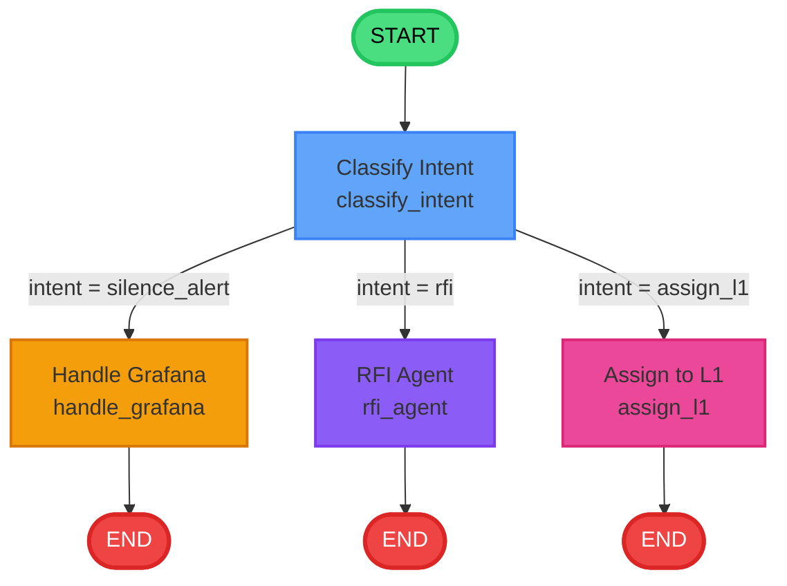
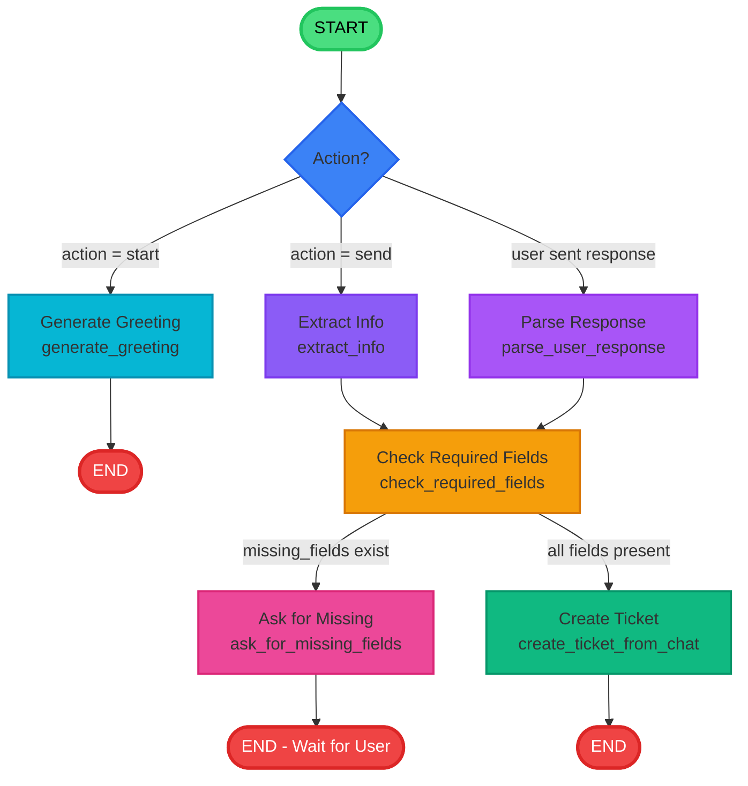

# LangGraph Workflow Diagrams - Snow AI Agent

## 1. Main Ticket Processing Workflow



### Node Descriptions

| Node | Function | Purpose | Output |
|------|----------|---------|--------|
| **classify_intent** | LLM Classification | Analyzes description to determine intent type | Sets `intent` field |
| **handle_grafana** | Alert Suppression | Silences Grafana alert for specified time window | Sets `closed=True`, `assigned_to="Snow Agent"` |
| **rfi_agent** | Web Research | Searches web via Tavily, summarizes with LLM | Sets `work_comments`, `closed=True` |
| **assign_l1** | L1 Assignment | Routes to L1 support team | Sets `assigned_to="L1 Team"` |

### Intent Classification Logic

**Prompt to LLM:**
> Output 'silence_alert' if user requests alert suppression in any form (silence, mute, suppress, disable, stop, acknowledge)
> Output 'rfi' if user asks for information/research
> Output 'assign_l1' for all other requests

**Heuristic Fallback Keywords:**
- **silence_alert**: silence, suppress, mute, disable, stop alert, acknowledge
- **rfi**: know more, how to, what is, explain, search, find, information
- **assign_l1**: Default for unmatched patterns

---

## 2. Chatbot Conversation Workflow



### Chatbot Nodes

| Node | Function | Purpose | Output |
|------|----------|---------|--------|
| **generate_greeting** | Welcome Message | Sends initial greeting to user | Sets `messages` with greeting |
| **extract_info** | LLM Extraction | Extracts intent, alert_id, description from user message | Populates state fields |
| **parse_user_response** | Response Parser | Parses follow-up answers to fill missing fields | Updates state with new info |
| **check_required_fields** | Validation | Checks if all required fields are present | Sets `missing_fields` list |
| **ask_for_missing_fields** | Follow-up Generator | Generates contextual question for missing info | Adds assistant message |
| **create_ticket_from_chat** | Ticket Creation | Creates ticket and processes via main workflow | Sets `ticket_created=True`, `ticket_id` |

### Conversation Flow Example

```
1. User: "start"
   → greeting (action=start) → generate_greeting → END
   
2. User: "suppress alert A-1"
   → extract_info → check_required_fields
   → [alert_id=A-1, description="suppress alert A-1"]
   → create_ticket → END
   
3. User: "block ip address"
   → extract_info → check_required_fields
   → [description="block ip address", missing: which IP?]
   → ask_for_missing_fields → END
   
4. User: "192.168.1.100"
   → parse_user_response → check_required_fields
   → [description="block ip address 192.168.1.100"]
   → create_ticket → END
```

---

## 3. Combined System Architecture

```mermaid
graph TB
    subgraph Frontend["Frontend (Next.js)"]
        UI[User Interface<br/>Chat / Forms]
        API_CLIENT[API Client<br/>api.ts]
    end
    
    subgraph Backend["Backend (FastAPI)"]
        CHAT[/chat Endpoint<br/>main.py]
        PROCESS[/process_ticket Endpoint<br/>main.py]
        
        subgraph ChatbotFlow["Chatbot Workflow"]
            CB_GREETING[greeting]
            CB_EXTRACT[extract]
            CB_CHECK[check_fields]
            CB_ASK[ask_missing]
            CB_CREATE[create_ticket]
        end
        
        subgraph MainFlow["Main Ticket Workflow"]
            M_CLASSIFY[classify_intent]
            M_GRAFANA[handle_grafana]
            M_RFI[rfi_agent]
            M_L1[assign_l1]
        end
    end
    
    subgraph External["External Services"]
        GROQ[Groq LLM<br/>llama-3.1-8b]
        TAVILY[Tavily Search<br/>Web Research]
        GRAFANA_API[Grafana API<br/>Alert Suppression]
        SNOW_API[ServiceNow API<br/>Ticket Management]
    end
    
    UI -->|HTTP POST| API_CLIENT
    API_CLIENT -->|/chat| CHAT
    API_CLIENT -->|/process_ticket| PROCESS
    
    CHAT --> ChatbotFlow
    CB_CREATE --> MainFlow
    PROCESS --> MainFlow
    
    M_CLASSIFY -.->|LLM Classification| GROQ
    M_GRAFANA -.->|Silence Alert| GRAFANA_API
    M_RFI -.->|Web Search| TAVILY
    M_RFI -.->|Summarization| GROQ
    MainFlow -.->|Store Tickets| SNOW_API
    
    style Frontend fill:#1e293b,stroke:#334155,stroke-width:2px,color:#fff
    style Backend fill:#0f172a,stroke:#1e293b,stroke-width:2px,color:#fff
    style External fill:#581c87,stroke:#6b21a8,stroke-width:2px,color:#fff
    style ChatbotFlow fill:#164e63,stroke:#155e75,stroke-width:2px,color:#fff
    style MainFlow fill:#7c2d12,stroke:#9a3412,stroke-width:2px,color:#fff
```

---

## 4. State Models

### SNOWState (Main Workflow)

```python
class SNOWState(BaseModel):
    ticket_id: Optional[str] = None           # TKT-1, TKT-2, etc.
    description: Optional[str] = None         # User's description
    intent: Optional[str] = None              # silence_alert | rfi | assign_l1
    alert_id: Optional[str] = None            # Grafana alert ID (A-1, A-2, etc.)
    ticket_type: Optional[str] = None         # Explicit type override
    assigned_to: Optional[str] = None         # "Snow Agent" | "RFI Agent" | "L1 Team"
    closed: Optional[bool] = None             # Ticket closure status
    start_time: Optional[datetime] = None     # Suppression start time
    end_time: Optional[datetime] = None       # Suppression end time
    result: Optional[str] = None              # Result message
    work_comments: Optional[str] = None       # Research results or notes
```

### ChatbotState (Conversation Workflow)

```python
class ChatbotState(BaseModel):
    session_id: str                           # Unique session identifier
    messages: List[Dict] = []                 # Conversation history
    intent: Optional[str] = None              # Detected intent
    description: Optional[str] = None         # Extracted description
    alert_id: Optional[str] = None            # Extracted alert ID
    missing_fields: List[str] = []            # Fields that need user input
    ticket_created: bool = False              # Whether ticket was created
    ticket_id: Optional[str] = None           # Created ticket ID
    details_requested: bool = False           # Prevent infinite loops
```

---

## 5. Workflow Decision Points

### Main Workflow: classify_intent

```
INPUT: state.description

DECISION LOGIC:
1. Check explicit state.ticket_type
   - If "rfi" → intent = "rfi"
   - If contains "silence" → intent = "silence_alert"

2. Use LLM classification
   - Send description to Groq LLM
   - Parse response for intent

3. Fallback to heuristics
   - Check for keywords:
     * "silence", "suppress", "mute", "disable" → "silence_alert"
     * "know more", "how to", "what is" → "rfi"
     * Default → "assign_l1"

OUTPUT: state.intent = "silence_alert" | "rfi" | "assign_l1"
```

### Chatbot Workflow: check_required_fields

```
INPUT: state.description, state.intent, state.alert_id

DECISION LOGIC:
1. If intent == "silence_alert":
   - Required: alert_id
   - Optional: start_time, end_time
   
2. If description is vague (< 10 chars or generic):
   - Add to missing_fields: "description_details"
   
3. Check details_requested flag:
   - If True and still missing → skip asking (avoid loops)
   - If False → allow asking once

OUTPUT: 
- state.missing_fields = [] → route to "complete"
- state.missing_fields = [...] → route to "has_missing"
```

---

## 6. Error Handling & Edge Cases

### Main Workflow

| Scenario | Handling |
|----------|----------|
| LLM API Failure | Fall back to heuristic keyword matching |
| Tavily Search Failure | Return formatted error message in work_comments |
| Grafana API Failure | Log error, set result message |
| Vague Description | Route to L1 for manual handling |

### Chatbot Workflow

| Scenario | Handling |
|----------|----------|
| Infinite Loop Prevention | `details_requested` flag prevents repeated asking |
| Session Not Found | Create new session with greeting |
| User Provides Partial Info | Parse response, update state, re-check fields |
| User Changes Topic | Extract new intent, create new ticket |

---

## 7. Workflow Execution Examples

### Example 1: Alert Suppression

```
User: "suppress alert A-1 for 1 hour"

Main Workflow:
START → classify_intent
  ├─ LLM detects: "silence_alert"
  ├─ state.intent = "silence_alert"
  ├─ state.alert_id = "A-1"
  └─ state.description = "suppress alert A-1 for 1 hour"
→ handle_grafana
  ├─ Call silence_alert("A-1", start=now, end=now+1h)
  ├─ state.assigned_to = "Snow Agent"
  ├─ state.closed = True
  └─ state.result = "Alert A-1 suppressed..."
→ END

Result: Ticket TKT-1, Status: CLOSED, Assigned: Snow Agent
```

### Example 2: Information Request

```
User: "what is kubernetes?"

Main Workflow:
START → classify_intent
  ├─ LLM detects: "rfi"
  ├─ state.intent = "rfi"
  └─ state.description = "what is kubernetes?"
→ rfi_agent
  ├─ TavilyClient.search("what is kubernetes?")
  ├─ Collect top 3 results
  ├─ LLM summarize with sources
  ├─ state.work_comments = "Kubernetes is..."
  ├─ state.assigned_to = "RFI Agent"
  └─ state.closed = True
→ END

Result: Ticket TKT-2, Status: CLOSED, Work Comments: Research findings
```

### Example 3: Chatbot with Follow-up

```
User: "start"
Chatbot → greeting → END
Bot: "👋 Hello! I'm the Snow AI Assistant..."

User: "block ip address"
Chatbot → extract_info
  ├─ state.intent = "general"
  ├─ state.description = "block ip address"
  └─ state.missing_fields = []
→ check_required_fields
  ├─ Description too vague
  ├─ state.missing_fields = ["description_details"]
  └─ state.details_requested = True
→ ask_for_missing_fields → END
Bot: "Which IP address would you like to block?"

User: "192.168.1.100"
Chatbot → parse_user_response
  ├─ Append "192.168.1.100" to description
  └─ state.description = "block ip address 192.168.1.100"
→ check_required_fields
  ├─ state.missing_fields = []
  └─ route: "complete"
→ create_ticket_from_chat
  ├─ Call main workflow with state
  ├─ state.ticket_created = True
  └─ state.ticket_id = "TKT-3"
→ END
Bot: "✅ Ticket TKT-3 has been created..."

Result: Ticket TKT-3, Type: general, Assigned: L1 Team
```

---

## 8. Performance Characteristics

| Metric | Value | Notes |
|--------|-------|-------|
| **Average Latency** | | |
| - Alert Suppression | 500-1000ms | Grafana API call + LLM classification |
| - RFI Agent | 2-5s | Web search (1-3s) + LLM summarization (1-2s) |
| - L1 Assignment | 200-500ms | LLM classification only |
| **Concurrent Sessions** | Unlimited | Stateless execution per request |
| **LLM Tokens** | | |
| - Classification | ~150 tokens | System prompt + user message |
| - RFI Summary | ~800 tokens | Context + summary generation |
| **Web Search** | Max 3 results | Tavily API limit for cost optimization |

---

## Documentation

For detailed implementation documentation:
- [Backend Documentation](BACKEND_DOCUMENTATION.md)
- [Frontend Documentation](FRONTEND_DOCUMENTATION.md)
- [Main README](README.md)

---

**Generated**: January 17, 2026  
**Framework**: LangGraph 0.0.20+  
**LLM**: Groq (llama-3.1-8b-instant)
